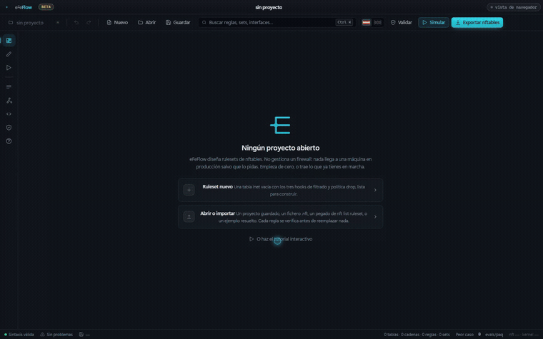
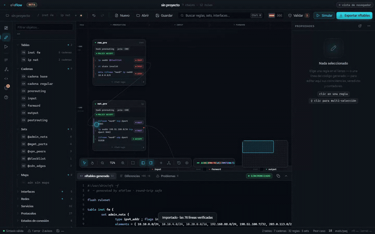
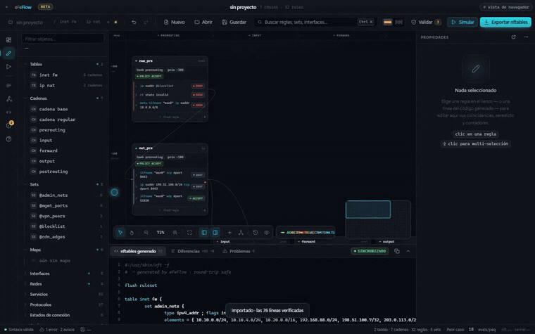

<div align="center">


# eFeFlow

### El IDE de nftables

**Deja de depurar tu firewall leyendo 800 líneas de reglas.**

Importa lo que ya tienes en marcha, mira qué falla, ve cómo lo recorre un
paquete y exporta código `nft` del que fiarte — antes de que nada toque
producción.

[](https://github.com/eFeSpain/efeflow/actions/workflows/ci.yml)
[](https://github.com/eFeSpain/efeflow/releases)
[](LICENSE)
[](#beta)

[English](README.md) · [Español](README.es.md)



</div>

---

## La regla que nunca se dispara

Todo administrador de Linux se ha topado con esta.

```nft
table inet filter {
	chain input {
		type filter hook input priority filter; policy drop;
		ct state established,related counter accept
		tcp dport { 80, 443 } counter accept
		ip saddr 10.10.0.0/24 tcp dport 443 accept
	}
}
```

La última regla no puede casar jamás. Todo lo que podría aceptar ya lo aceptó la
de encima. Cuesta una evaluación en cada paquete y no cambia nada.

Aquí se ve. Cuatro reglas caben en una pantalla.

Ahora ponla en la línea 411 de 800, detrás de dos `jump`, en una tabla que
heredaste de alguien que ya no está. Nada está roto. `nft -c` la da por buena.
`nft list ruleset` te la imprime de vuelta sin decir nada. La regla simplemente
está muerta y no hay nada en el fichero que lo diga.

Ese es el problema. No la sintaxis — **el orden**. Y el orden es invisible en un
fichero de texto.

## Qué hace eFeFlow con eso

Lee tu ruleset como lo lee el kernel, y después te cuenta lo que ha encontrado.

|  |  |
|---|---|
| **Simula un paquete** | descríbelo, míralo recorrer tus cadenas regla a regla y ve exactamente cuál lo decide |
| **Encuentra reglas que nunca pueden casar** | reglas eclipsadas, destinos DNAT en conflicto, cadenas que confían en conntrack y nunca descartan `invalid` — derivado de tus reglas, nunca escrito a mano |
| **Importa lo que ya tienes en marcha** | pega `nft list ruleset` y te demuestra el round-trip línea a línea antes de importar nada |
| **Aplica con red** | el rollback se arma **en el firewall**, así que la regla que te corta el acceso no puede impedirte deshacerla |
| **Exporta nft de verdad** | no un formato propio. Lo que sale es lo que habrías escrito tú |

---

## ¿Qué regla va a aceptar este paquete?

<div align="center">

</div>

Nada más responde a esto cómodamente. `nft monitor trace` puede, si estás
dispuesto a instrumentar un firewall en producción y leer la salida en crudo.

Aquí describes el paquete y lo ves ir: por cada hook en el orden en que los toma
el kernel, entrando en las cadenas enganchadas a cada uno, regla a regla, hasta
un veredicto — **y es el veredicto que produce tu ruleset exportado**, porque el
simulador evalúa el mismo modelo del que se emite el código.

Modela nftables de verdad, en ambas familias. `accept` termina la cadena, no el
paquete. `ip6 saddr` restringe IPv6 y nada más. Desactivar conntrack marca el
paquete como `untracked`, así que las reglas `ct state` dejan de casar. `tcp
flags syn` casa con `syn|ack`; `tcp flags & (syn|ack) == syn` no. Una tabla con
`flags dormant` no se recorre en absoluto, porque el kernel tampoco la recorre.

Y donde no puede modelar algo —nftables es un lenguaje más grande que cualquier
modelo suyo— **lo dice en vez de suponer en silencio**. Una regla con un `meta
mark` o una consulta `fib` se da por coincidente, se marca en la traza y se
nombra bajo el veredicto: esto es una suposición, y esta es la parte que se ha
asumido en lugar de evaluarse.

## La regla que no sabías que estaba muerta

<div align="center">

</div>

Casi todos los administradores tienen reglas eclipsadas. Casi ninguno lo sabe,
porque nada en la cadena de herramientas lo dice — el ruleset carga, así que el
ruleset está bien.

eFeFlow lo deduce por subsunción: la regla A eclipsa a la B cuando todo paquete
que casa con B ya casa con A, y A va antes y es terminal. Te enseña las dos
reglas, dice qué paquetes están en juego y se ofrece a borrar la muerta.

Los hallazgos se derivan del ruleset en cada cambio, nunca se escriben a mano.

| | |
|---|---|
| **Eclipsada** | una regla que ya decide otra anterior |
| **Conflicto** | reglas DNAT solapadas con destinos distintos |
| **Dormant** | una tabla entera cargada y sin aplicarse |
| **Fusión** | reglas que solo difieren en el puerto, sustituibles por una consulta a set |
| **Sin usar** | un set cargado en el kernel que ninguna regla consume |
| **Fortificación** | una cadena que confía en conntrack pero nunca descarta `invalid` |
| **Resiliencia** | una regla de log sin límite de tasa |

Casi todos llevan corrección de un clic. Todo es deshacible.

Y donde no puede leer una regla entera, **se niega a juzgarla** y dice cuántas ha
dejado en paz, en vez de llamar muerta a una regla viva.

## No empiezas de cero

Pega `nft list ruleset`, o léelo directamente de una máquina.

Antes de importar nada, eFeFlow **reemite el fichero entero desde su propio
modelo y lo compara con el tuyo, línea a línea** — reglas, cabeceras de cadena,
sets, flags de tabla, `define`, y las flowtables, counters con nombre y helpers
de ct que conserva intactos en vez de modelar.

El porcentaje que te enseña no es una promesa, es una prueba. Si una línea no se
puede reproducir, te dice cuál antes de que te comprometas a nada.

---

<a name="beta"></a>

## ⚠ Beta

Hace el trabajo completo hoy: importar, demostrar, analizar, simular, editar,
aplicar y exportar. Lo respaldan 481 comprobaciones automáticas, sobre el
parser, el analizador, el evaluador de paquetes y la propia interfaz.

Lo que todavía no tiene es kilometraje. **Ningún ruleset que no sea el de su
autor ha pasado por él.** Por eso mismo te dice cuándo no está seguro en vez de
suponer, por eso el round-trip informa de un número y no de un visto bueno, y
por eso el rollback se arma en el firewall y no en esta ventana.

Trata lo que genera como un **borrador que revisas**. Valida con `nft -c` antes
de aplicar nada, y mantén acceso por consola a cualquier máquina donde apliques.

Dejará de ser beta cuando rulesets de otra gente importen al 100%, y cuando el
camino de aplicar lo haya ejercitado contra un firewall real alguien que no lo
escribió. Los [informes de fallo](#contribuir) —sobre todo un ruleset que no
sobreviva al round-trip— son la vía más rápida hasta ahí.

---

## Los cinco minutos que lo enseñan todo

1. **Importa.** Pega el `nft list ruleset` de un firewall real. Lee el
   porcentaje de round-trip antes de pulsar nada.
2. **Mira Validación.** Los hallazgos ya están ahí — no hay que ejecutar nada.
3. **Abre la eclipsada.** Te enseña las dos reglas y qué paquetes se disputan.
   Acepta la corrección de un clic, o arrastra la regla a donde le toca.
4. **Simula el paquete que te preocupaba.** Míralo llegar a un veredicto
   distinto del de hace un minuto.
5. **Exporta**, o **aplica** con un rollback de 60 segundos armado en la máquina.


El lienzo coloca cada cadena en el hook de netfilter al que está enganchada —de
izquierda a derecha, en el orden en que un paquete los encuentra— y en su
prioridad, de arriba abajo. **La posición es significado**: el orden de
evaluación se lee en la pantalla en lugar de reconstruirlo mentalmente. Los dos
paneles laterales se pliegan con `[` y `]` cuando quieres el ruleset entero a la
vista.

---

## Instalar

Coge un instalador de [**Releases**](https://github.com/eFeSpain/efeflow/releases/latest):
Linux `.deb` `.rpm` `.AppImage` · Windows `.msi` · macOS `.dmg`

### Dónde se ejecuta `nft`

`nft` solo existe en Linux, así que las integraciones nativas difieren:

| | Linux | Windows | macOS |
|---|:---:|:---:|:---:|
| Diseñar, analizar, simular, importar, exportar | ✅ | ✅ | ✅ |
| Validar con un `nft -c` local | ✅ | — | — |
| Leer un `nft list ruleset` local | ✅ | — | — |
| Ambas cosas **por SSH** | ✅ | ✅ | ✅ |

**SSH no es el plan B, es el diseño**: el firewall rara vez es la máquina donde
tienes el editor abierto. Pulsa el chip de arriba a la derecha para apuntar
eFeFlow a un host. Delega en el `ssh` del sistema, así que tus claves, tu agente
y tu `~/.ssh/config` ya se aplican, y eFeFlow no guarda credenciales.

### Aplicar, y poder cambiar de opinión

Nada llega a una máquina en producción si no lo pides tú. Y cuando lo pides,
aplicar es la única operación que puede dejarte fuera de una máquina, y el fallo
tiene una forma desagradable: la regla que te corta el acceso es la que te impide
deshacerla. Un botón de rollback en el editor no sirve, porque el editor está al
otro lado del firewall que acaba de romper.

Por eso la red se arma **en la máquina**. Antes de escribir nada, eFeFlow copia
allí el ruleset en marcha y lanza un temporizador desacoplado que lo restaura
salvo que se le diga que no. Conservar lo aplicado es un acto deliberado;
perder la conexión, la ventana o el portátil lo restaura. Los routers llevan
treinta años llamándolo commit-confirm.

Además reemplaza **solo las tablas de tu proyecto** por defecto. `flush ruleset`
vacía el kernel, y en una máquina que también corre Docker, libvirt, kubernetes
o fail2ban eso borra sus tablas — y ninguno se dará cuenta ni las repondrá. Las
dos opciones vuelven a la segura cada vez que se abre el diálogo.

`nft -c` se ejecuta en la máquina antes de escribir un solo byte, y se niega
por ti.

### Cuando ya está en marcha

Un ruleset aplicado deja de ser un documento, y tres acciones del lienzo lo
tratan como una máquina:

**Leer contadores** trae de vuelta `nft list ruleset` y pone los paquetes y
bytes reales sobre tus reglas. Es la única respuesta honesta a *¿esta regla se
usa alguna vez?* — el analizador sabe decirte que una regla es inalcanzable,
pero solo el kernel sabe decirte que una alcanzable lleva seis semanas sin casar
nada.

**Vigilar** engancha `nft monitor` y te informa de cada cambio que haga la
máquina mientras lo tengas abierto, lo haga quien lo haga.

**Handle** — el chip de una regla importada de una máquina — envía esa regla
sola, por su handle, sin tocar el resto de la tabla. El handle es el único
nombre estable que tiene una regla: sobrevive a que la reordenen, y el texto no.

Las tres leen la máquina primero. El envío se niega en seco salvo que la regla
que va a nombrar siga siendo, línea por línea, la que la máquina tiene bajo ese
handle — y salvo que la cadena entera siga coincidiendo. Acertar aproximadamente
qué regla estás borrando es peor que no borrar ninguna.

---

## También lleva

**Sets y maps** como activos reales, con retro-referencias calculadas de tus
reglas — renombra uno y todas las reglas que lo usan le siguen. **Objetos con
nombre**: flowtables, counters, quotas, helpers y timeouts de ct, editables y no
solo conservados. **Tablas** con propiedades propias, incluido `flags dormant`.
**Topología** derivada de las interfaces que tus reglas nombran de verdad, nada
declarado. **Código en vivo** que se reemite según escribes, donde pulsar una
línea selecciona la regla, con cinco formatos de exportación. **Un editor de
reglas en texto libre** con un linter que te dice qué rechazaría `nft` antes de
preguntárselo. **netdev ingress/egress**, IPv6 de principio a fin,
concatenaciones, `typeof`, `define` e `include`.

Bilingüe, español e inglés. El vocabulario de nftables nunca se traduce:
escribes `accept`, no `aceptar`.

---

## Compilar desde el código

```bash
npm install
npm run app          # la aplicación de escritorio
npm run dev          # o solo el frontend, en un navegador
npm test             # 481 aserciones
npm run app:build    # instaladores en src-tauri/target/release/bundle/
```

Necesita los [prerrequisitos de Tauri](https://tauri.app/start/prerequisites/)
de tu plataforma. En Debian/Ubuntu:

```bash
sudo apt install libwebkit2gtk-4.1-dev libgtk-3-dev librsvg2-dev patchelf
```

---

<a name="contribuir"></a>

## Contribuir

Los informes de fallos son bienvenidos — sobre todo un ruleset que no sobreviva
a la comprobación de round-trip. Ese es el tipo de fallo que merece la pena
conocer: pega el ruleset y lo que dijo la comprobación.

[**Cómo está construido**](docs/architecture.md) cubre la organización de los
módulos, por qué el núcleo se mantiene libre de DOM y cómo surgieron las tres
capas de pruebas.

## Licencia

MIT
