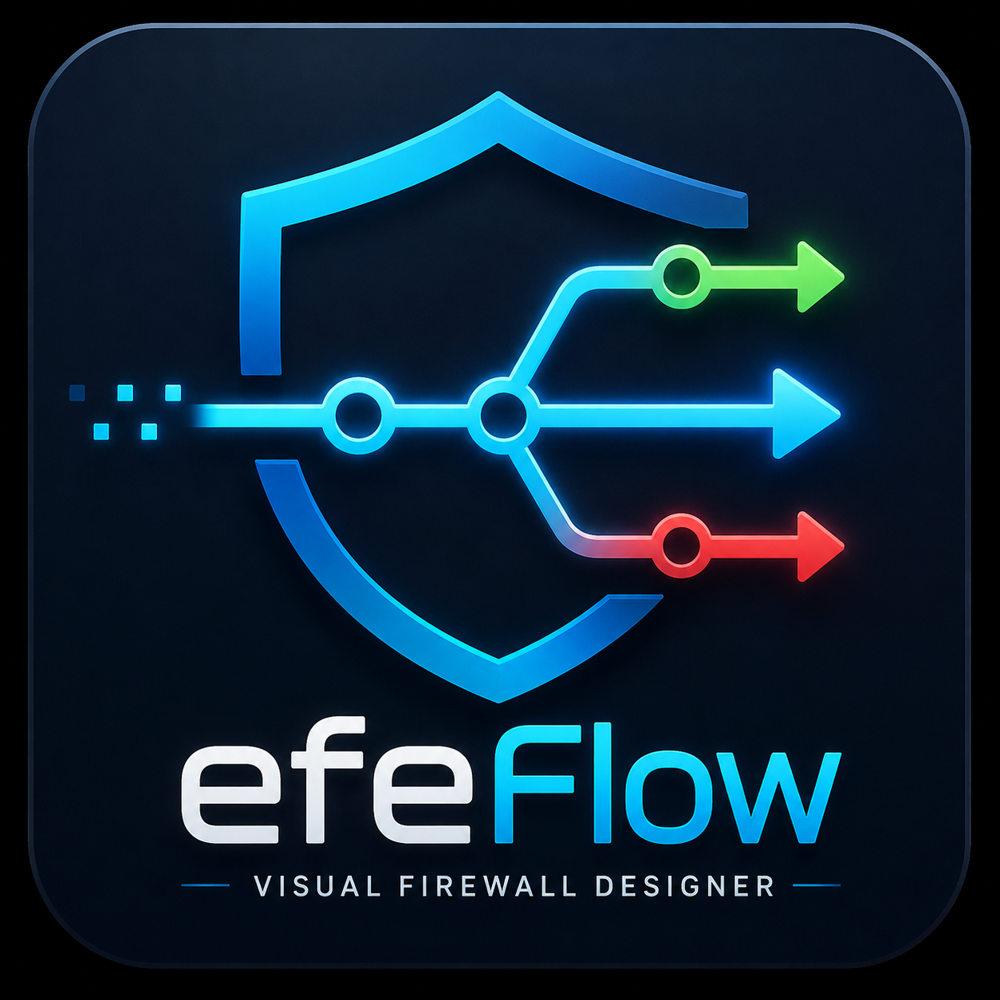
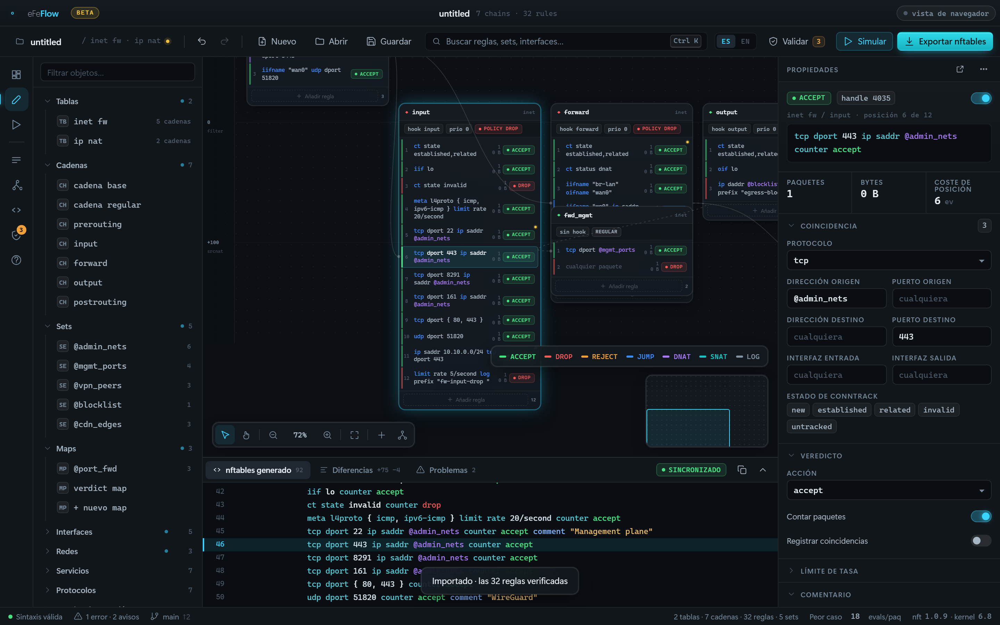
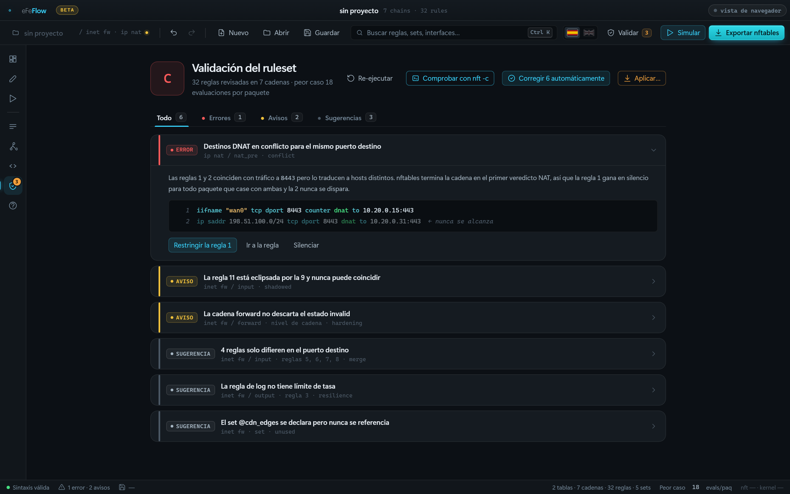
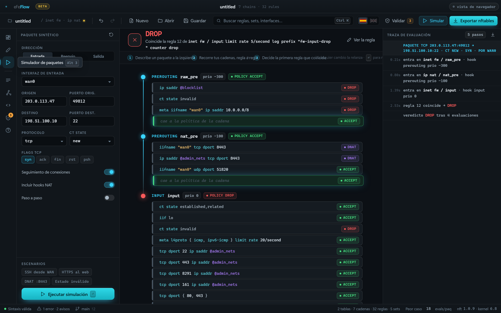
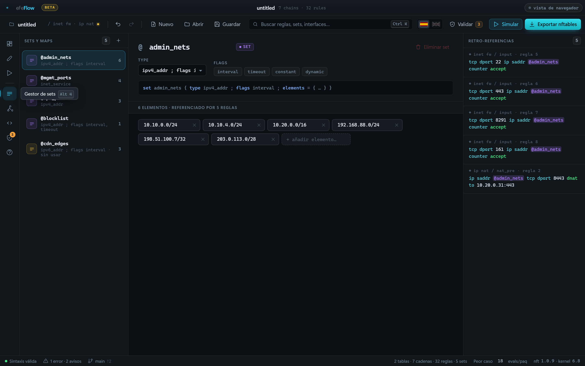
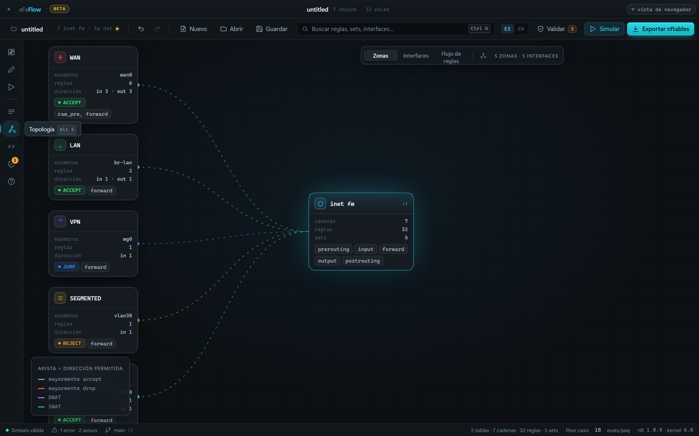
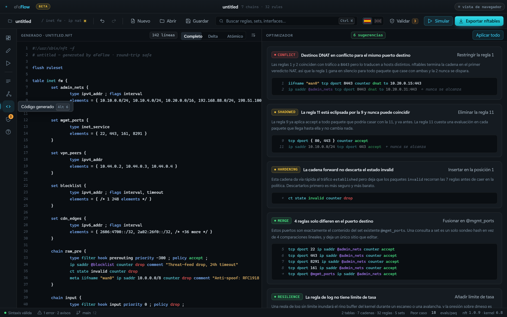
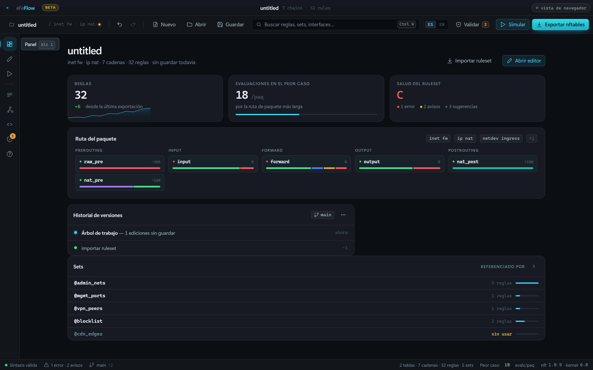

<div align="center">



# eFeFlow

**Diseña reglas de firewall de Linux visualmente. Obtén código `nft` limpio.**

[](https://github.com/eFeSpain/efeflow/actions/workflows/ci.yml)
[](https://github.com/eFeSpain/efeflow/releases)
[](LICENSE)
[](#-beta)

[English](README.md) · [Español](README.es.md)



</div>

---

## ⚠ Beta

eFeFlow está **en desarrollo activo**. El parser, el analizador y el evaluador
de paquetes tienen suite automatizada, pero la herramienta es joven y
encontrarás aristas.

Trata lo que genera como un **borrador que revisas**, no como una salida en la
que confiar a ciegas. Valida con `nft -c` antes de aplicar nada, y mantén acceso
por consola a cualquier máquina donde apliques un ruleset.

---

## Qué hace

Un ruleset de nftables es una lista ordenada de texto donde la posición es
significado, y una sola regla mal colocada eclipsa en silencio a las diez de
abajo. eFeFlow lo hace visible.

**Es un diseñador, no un gestor de firewall.** Edita un ruleset y emite código
`nft`. Nada llega a una máquina en producción salvo que lo pidas.

### El lienzo es un campo, no una pizarra

Cada cadena se sitúa en el hook de netfilter al que está enganchada —de
izquierda a derecha, en el orden en que un paquete los encuentra— y en su
prioridad, de arriba abajo. **La posición es significado**: el orden de
evaluación se lee en la pantalla en lugar de reconstruirlo mentalmente.

Añade una cadena pulsando su hook en la franja superior, o arrastrando una desde
la biblioteca. Arrastra reglas para reordenarlas, incluso entre cadenas. Cada
regla lleva una franja de color con su verdict, así que entornar los ojos ante
una cadena da el código de barras de la política.

### Te dice qué está mal en tu ruleset



Los hallazgos se derivan del ruleset en cada cambio, nunca están escritos a mano.

| | |
|---|---|
| **Eclipsada** | una regla que ya decide otra anterior |
| **Conflicto** | reglas DNAT solapadas con destinos distintos |
| **Fusión** | reglas que solo difieren en el puerto, sustituibles por una consulta a set |
| **Sin usar** | un set cargado en el kernel que ninguna regla consume |
| **Fortificación** | una cadena que confía en conntrack pero nunca descarta `invalid` |
| **Resiliencia** | una regla de log sin límite de tasa |

Casi todos llevan corrección de un clic. Todo es deshacible.

### Pasa tu paquete por tus reglas



Describe un paquete y míralo recorrer las cadenas, regla a regla, hasta un
veredicto — y es el veredicto que produce tu ruleset exportado, porque el
simulador evalúa el mismo modelo del que se emite el código.

Modela nftables de verdad, en ambas familias. `accept` termina la cadena, no el
paquete. `ip6 saddr` restringe IPv6 y nada más. Desactivar conntrack marca el
paquete como `untracked`, así que las reglas `ct state` dejan de casar. `tcp
flags syn` casa con `syn|ack`; `tcp flags & (syn|ack) == syn` no.

Y donde no puede modelar algo —nftables es un lenguaje más grande que cualquier
modelo suyo— **lo dice en vez de suponer en silencio**. Una regla con un `meta
mark` o una consulta `fib` se da por coincidente, se marca en la traza y se
nombra bajo el veredicto: esto es una suposición, y esta es la parte que se ha
asumido en lugar de evaluarse.

### Importa lo que ya tienes en marcha, y lo demuestra

Pega `nft list ruleset`, o léelo directamente de una máquina. Antes de importar
nada, eFeFlow **reemite el fichero entero desde el modelo y lo compara línea a
línea** — reglas, cabeceras de cadena, sets, flags de tabla, y las flowtables,
counters con nombre y helpers de ct que conserva intactos en vez de modelar. El
porcentaje que muestra es la prueba honesta de que no se ha perdido nada por el
camino, y si una línea no se puede reproducir te dice cuál.

### Y lo demás

<table>
<tr>
<td width="50%"><br><b>Sets como activos reales</b><br>Retro-referencias calculadas de tus reglas. Renombra uno y todas las reglas que lo usan le siguen.</td>
<td width="50%"><br><b>Topología desde las reglas</b><br>Interfaces y zonas derivadas de lo que tus reglas nombran. Nada declarado.</td>
</tr>
<tr>
<td><br><b>Código en vivo</b><br>Editas un campo y el nft se reemite. Pulsas una línea y selecciona la regla. Cinco formatos de exportación.</td>
<td><br><b>El ruleset de un vistazo</b><br>Ruta del paquete, salud, evaluaciones en el peor caso por paquete.</td>
</tr>
</table>

Bilingüe de principio a fin, español e inglés. El vocabulario de nftables nunca
se traduce: escribes `accept`, no `aceptar`.

---

## Instalar

Coge un instalador de [**Releases**](https://github.com/eFeSpain/efeflow/releases/latest):
Linux `.deb` `.rpm` `.AppImage` · Windows `.msi` · macOS `.dmg`

### Dónde se ejecuta `nft`

`nft` solo existe en Linux, así que las integraciones nativas difieren:

| | Linux | Windows | macOS |
|---|:---:|:---:|:---:|
| Diseñar, analizar, simular, importar, exportar | ✅ | ✅ | ✅ |
| Validar con un `nft -c` local | ✅ | — | — |
| Leer un `nft list ruleset` local | ✅ | — | — |
| Ambas cosas **por SSH** | ✅ | ✅ | ✅ |

**SSH no es el plan B, es el diseño**: el firewall rara vez es la máquina donde
tienes el editor abierto. Pulsa el chip de arriba a la derecha para apuntar
eFeFlow a un host. Delega en el `ssh` del sistema, así que tus claves, tu agente
y tu `~/.ssh/config` ya se aplican, y eFeFlow no guarda credenciales.

### Aplicar, y poder cambiar de opinión

Aplicar es la única operación que puede dejarte fuera de una máquina, y el
fallo tiene una forma desagradable: la regla que te corta el acceso es la que
te impide deshacerla. Un botón de rollback en el editor no sirve, porque el
editor está al otro lado del firewall que acaba de romper.

Por eso la red se arma **en la máquina**. Antes de escribir nada, eFeFlow copia
allí el ruleset en marcha y lanza un temporizador desacoplado que lo restaura
salvo que se le diga que no. Conservar lo aplicado es un acto deliberado;
perder la conexión, la ventana o el portátil lo restaura. Los routers llevan
treinta años llamándolo commit-confirm.

Además reemplaza **solo las tablas de tu proyecto** por defecto. `flush ruleset`
vacía el kernel, y en una máquina que también corre Docker, libvirt, kubernetes
o fail2ban eso borra sus tablas — y ninguno se dará cuenta ni las repondrá. Las
dos opciones vuelven a la segura cada vez que se abre el diálogo.

`nft -c` se ejecuta en la máquina antes de escribir un solo byte, y se niega
por ti.

---

## Compilar desde el código

```bash
npm install
npm run app          # la aplicación de escritorio
npm run dev          # o solo el frontend, en un navegador
npm test             # 331 aserciones
npm run app:build    # instaladores en src-tauri/target/release/bundle/
```

Requiere los [prerrequisitos de Tauri](https://tauri.app/start/prerequisites/)
de tu plataforma. En Debian/Ubuntu:

```bash
sudo apt install libwebkit2gtk-4.1-dev libgtk-3-dev librsvg2-dev patchelf
```

---

## Contribuir

Los informes de fallo son bienvenidos, sobre todo un ruleset que no sobreviva la
verificación de ida y vuelta. Ese es el tipo de bug que conviene conocer: pega
el ruleset y lo que reportó la verificación.

[**Cómo está construido**](docs/architecture.md) cubre la estructura de módulos,
por qué el núcleo se mantiene libre de DOM, y cómo surgieron las tres capas de
pruebas.

## Licencia

MIT
