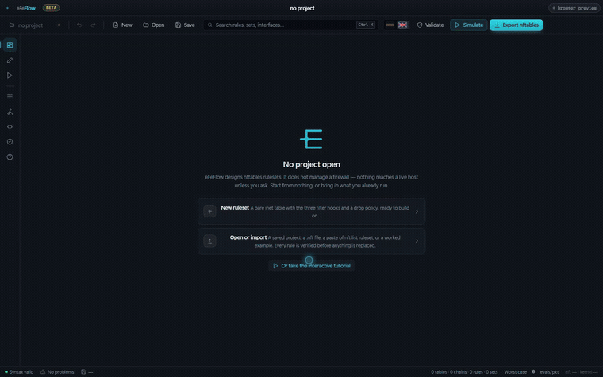
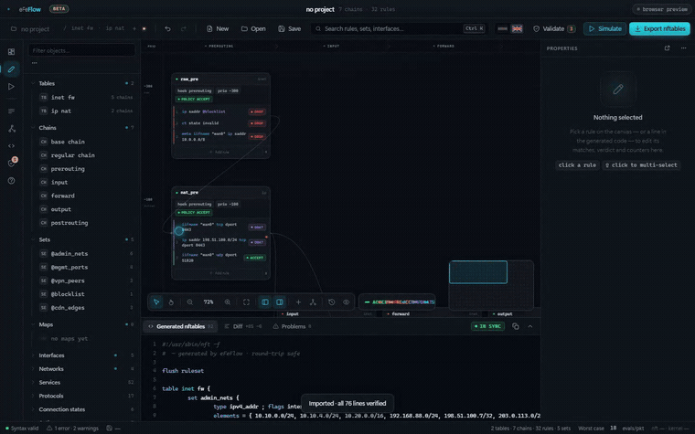
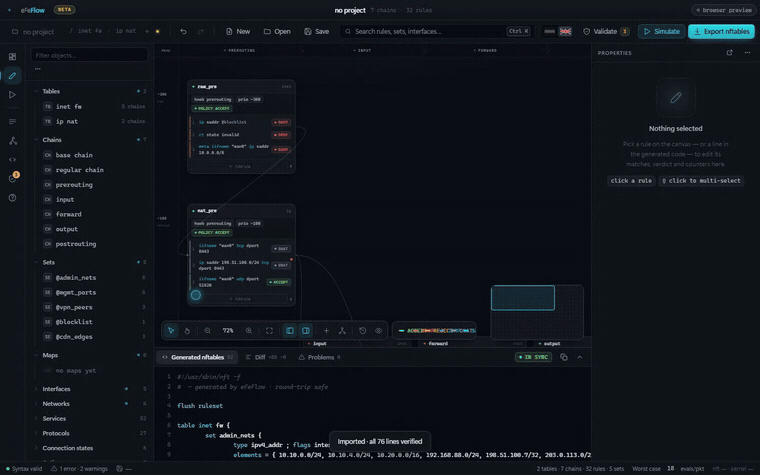

<div align="center">


# eFeFlow

### The IDE for nftables

**Stop debugging your firewall by reading 800 lines of rules.**

Import what you already run, see what is wrong with it, watch a packet walk it,
and export nft source you can trust — before anything touches production.

[](https://github.com/eFeSpain/efeflow/actions/workflows/ci.yml)
[](https://github.com/eFeSpain/efeflow/releases)
[](LICENSE)
[](#beta)

[English](README.md) · [Español](README.es.md)



</div>

---

## The rule that never fires

Every Linux admin has met this one.

```nft
table inet filter {
	chain input {
		type filter hook input priority filter; policy drop;
		ct state established,related counter accept
		tcp dport { 80, 443 } counter accept
		ip saddr 10.10.0.0/24 tcp dport 443 accept
	}
}
```

The last rule can never match. Everything it could accept, the rule above it
already accepted. It costs an evaluation on every packet and changes nothing.

You can see that here. Four rules fit on a screen.

Now put it at line 411 of 800, behind two `jump`s, in a table you inherited from
someone who left. Nothing is broken. `nft -c` is happy. `nft list ruleset`
prints it back to you without comment. The rule is simply dead and there is
nothing in the file that says so.

That is the problem. Not syntax — **order**. And order is invisible in a text
file.

## What eFeFlow does about it

It reads your ruleset the way the kernel does, and then tells you what it found.

|  |  |
|---|---|
| **Simulate a packet** | describe one, watch it walk your chains rule by rule, and see exactly which one decides it |
| **Find rules that can never match** | shadowed rules, conflicting DNAT targets, chains that trust conntrack but never drop `invalid` — derived from your rules, never authored |
| **Import what you already run** | paste `nft list ruleset` and it proves the round-trip line by line before it imports a thing |
| **Apply with a net** | the rollback arms **on the firewall**, so the rule that cuts you off cannot stop you undoing it |
| **Export real nft source** | not a config format of its own. What comes out is what you would have written |

---

## Which rule is going to accept this packet?

<div align="center">

</div>

Nothing else answers this comfortably. `nft monitor trace` can, if you are
willing to instrument a production firewall and read the output raw.

Here you describe the packet and watch it go: through every hook in the order
the kernel takes them, into the chains attached to each, rule by rule, to a
verdict — **and it is the verdict your exported ruleset produces**, because the
simulator evaluates the same model the code is emitted from.

It models nftables properly, in both families. `accept` ends the chain, not the
packet. `ip6 saddr` constrains IPv6 and nothing else. Turning conntrack off
marks the packet `untracked`, so `ct state` rules stop matching it. `tcp flags
syn` matches `syn|ack`; `tcp flags & (syn|ack) == syn` does not. A table with
`flags dormant` is not walked at all, because the kernel does not walk it either.

And where it cannot model something — nftables is a larger language than any
model of it — **it says so rather than guessing quietly**. A rule carrying a
`meta mark` or an `fib` lookup is taken as matching, marked in the trace, and
named under the verdict: this one is a guess, and this is the part of it that
was assumed rather than evaluated.

## The rule you did not know was dead

<div align="center">

</div>

Most admins have shadowed rules. Most do not know it, because nothing in the
toolchain says so — the ruleset loads, so the ruleset is fine.

eFeFlow works it out from subsumption: rule A shadows rule B when every packet
matching B already matches A, and A comes first and is terminal. It shows you
both rules, says which packets are involved, and offers to delete the dead one.

Findings are derived from the ruleset on every change, never written by hand.

| | |
|---|---|
| **Shadowed** | a rule an earlier one already decides |
| **Conflict** | overlapping DNAT rules with different targets |
| **Dormant** | a whole table loaded and not running |
| **Unbounded set** | a set filled by traffic with no `size` or `timeout` — kernel memory a stranger decides the size of |
| **Full set** | a set at 90% of its own `size`, past which the kernel silently refuses new elements |
| **Merge** | rules differing only by port, which one set lookup replaces |
| **Unused** | a set loaded into the kernel that no rule consumes |
| **Hardening** | a chain that trusts conntrack but never drops `invalid` |
| **Resilience** | a log rule with no rate limit |
| **Cold** | rules the kernel says have matched nothing since the ruleset was loaded |

Most carry a one-click fix. Everything is undoable.

And where it cannot read a rule whole, **it refuses to judge it** and says how
many it left alone, rather than calling a live rule dead.

Shadowing is weighed **within a chain**, never across a `jump`. A rule made
unreachable by a terminal rule in the chain that jumped to it is not reported,
because deciding that safely means knowing every way into the chain — and being
wrong about it means offering to delete a rule that fires. The same
conservatism as everywhere else here: the findings you get are ones it can
stand behind, not every one there is.

## You do not start from nothing

Paste `nft list ruleset`, or read it straight from a host.

Before importing anything, eFeFlow **re-emits the whole file from its own model
and compares it to yours, line by line** — rules, chain headers, sets, table
flags, `define`s, and the flowtables, named counters and ct helpers it carries
through untouched rather than modelling.

The percentage it shows you is not a promise, it is evidence. If a line cannot
be reproduced, it tells you which one before you commit to anything.

---

<a name="beta"></a>

## ⚠ Beta

It does the whole job today: import, prove, analyse, simulate, edit, apply,
export. 568 automated assertions stand behind it, across the parser, the
analyser, the packet evaluator and the interface itself.

What it does not have yet is mileage. **No ruleset but its author's has ever
been through it.** That is exactly why it tells you when it is not sure instead
of guessing, why the round-trip check reports a number rather than a thumbs-up,
and why the rollback arms on the firewall rather than in this window.

Treat what it generates as a **draft you review**. Validate with `nft -c` before
applying anything, and keep console access to any machine you apply to.

It stops being a beta when other people's rulesets import at 100%, and when the
apply path has been exercised against a real firewall by somebody who did not
write it. [Bug reports](#contributing) — especially a ruleset that fails the
round-trip — are the fastest way there.

---

## The five minutes that show all of it

1. **Import.** Paste `nft list ruleset` from a real firewall. Read the
   round-trip percentage before you click anything.
2. **Look at Validation.** Findings are already there — nothing to run.
3. **Open the shadowed one.** It shows you both rules and which packets they
   fight over. Take the one-click fix, or drag the rule where it belongs.
4. **Simulate the packet you were worried about.** Watch it reach a different
   verdict than it did a minute ago.
5. **Export**, or **apply** with a 60-second rollback armed on the host.


The canvas puts each chain at the netfilter hook it is attached to — left to
right in the order a packet meets them — and at its priority, top to bottom.
**Position is meaning**: you read evaluation order off the screen instead of
reconstructing it in your head. Both side panels fold away with `[` and `]` when
you want the whole ruleset in view.

---

## The same questions, without a window

Everything that decides anything lives in `src/core/` and never touches the
DOM. That rule exists so the parser can be tested against a real `nft list
ruleset` dump — and it means a pipeline can ask what the interface asks, before
a ruleset reaches a machine.

```console
$ efeflow lint fw.nft
fw.nft:103  error conflict   Conflicting DNAT targets for the same destination port
      ip saddr 198.51.100.0/24 tcp dport 8443 dnat to 10.20.0.31:443
fw.nft:71   warn  shadowed   Rule 11 is shadowed by rule 9 and can never match
      ip saddr 10.10.0.0/24 tcp dport 443 accept

  32 rules in 7 chains across 2 tables  ·  round-trip 76/76 = 100%
  1 error  2 warnings  3 hints
```

`--json` for something that is not a person, `-` to read from a pipe,
`--fail-on error|warn|hint|never` to move the threshold. Exit **0** when nothing
at or above it was found, **1** when something was, and **2** when a file could
not be read at all — because a green tick that only means nobody checked is
worse than no tick.

```yaml
- run: npx github:eFeSpain/efeflow lint --fail-on warn nftables/*.nft
```

**It is not a replacement for `nft -c`, and it does not pretend to be.** It
keeps what it cannot model rather than rejecting it, so a line that is not
nftables at all rides through as text and is reported by nobody. `--nft` hands
the file to the real thing where the real thing exists; where it does not, it
says which opinion is missing rather than implying there were two.

---

## Install

Grab an installer from [**Releases**](https://github.com/eFeSpain/efeflow/releases/latest):
Linux `.deb` `.rpm` `.AppImage` · Windows `.msi` · macOS `.dmg`

### Where `nft` runs

`nft` only exists on Linux, so the native integrations differ:

| | Linux | Windows | macOS |
|---|:---:|:---:|:---:|
| Design, analyse, simulate, import, export | ✅ | ✅ | ✅ |
| Validate with a local `nft -c` | ✅ | — | — |
| Read a local `nft list ruleset` | ✅ | — | — |
| Both of those **over SSH** | ✅ | ✅ | ✅ |

**SSH is not a fallback, it is the design** — the firewall is rarely the machine
with your editor open. Nobody administers one box either, so the chip in the
top right keeps the list of the ones you look after — on this machine and in
every project, because an inventory describes your estate rather than the
ruleset you have open. Click it to point eFeFlow at a
host. It shells out to the system `ssh`, so your keys, your agent and
`~/.ssh/config` already apply, and eFeFlow stores no credentials.

### Applying, and being able to change your mind

Nothing reaches a live host unless you ask. When you do ask, applying is the one
operation that can lock you out of a machine, and the failure has a nasty shape:
the rule that cuts you off is the rule that stops you undoing it. A rollback
button in the editor is no use, because the editor is on the wrong side of the
firewall it just broke.

So the net is armed **on the host**. Before anything is written, eFeFlow copies
the running ruleset aside there and starts a detached timer that puts it back
unless it is told not to. Keeping what you applied is a deliberate act; losing
the connection, the window or the laptop restores. Routers have called this
commit-confirm for thirty years.

It also replaces **only the tables your project owns** by default. `flush
ruleset` empties the kernel, and on a machine that also runs Docker, libvirt,
kubernetes or fail2ban that deletes their tables too — none of which will
notice or put them back. Both choices reset to the safe one every time the
dialog opens.

`nft -c` runs on the host before a byte is written, and refuses for you.

### Once it is running

A ruleset that has been applied is no longer a document, and three things on
the canvas treat it as a machine:

**Read counters** pulls `nft list ruleset` back and puts the real packet and
byte counts on your rules. It is the only honest answer to *is this rule ever
hit* — the analyser can prove a rule unreachable, but only the kernel can tell
you that a reachable one has matched nothing. Rules at zero are marked cold on
the canvas and collected in a finding, and the words are exactly *since the
ruleset was loaded*, because that is what a counter knows. A rule carrying no
`counter` is not cold, it is unmeasured, and it is counted separately.

**Watch** attaches `nft monitor` and reports every change the host makes while
you have it open, whoever made it.

**Handle** — the chip on a rule imported from a host — pushes that one rule,
by its handle, without touching the rest of the table. Handles are the only
stable name a rule has: they survive reordering, and text does not.

All three read the host first. The push refuses outright unless the rule it is
about to name is still, line for line, the rule the host has under that handle
— and unless the whole chain still agrees. Being approximately right about
which rule you are deleting is worse than not deleting one.

---

## Also in there

**Sets and maps** as real assets, with back-references computed from your rules —
rename one and every rule that uses it follows. **Named objects**: flowtables,
counters, quotas, ct helpers and timeouts, editable rather than merely
preserved. **Tables** with their own properties, including `flags dormant`.
**Topology** derived from the interfaces your rules actually name, nothing
declared. **Live source** that re-emits as you type, where clicking a line
selects the rule, with five export formats. **A free-text rule editor** with a
linter that tells you what `nft` would reject before `nft` is asked. **netdev
ingress/egress**, IPv6 throughout, concatenations, `typeof`, `define` and
`include`.

Bilingual, English and Spanish. nftables vocabulary is never translated — you
write `accept`, not `aceptar`.

---

## Build from source

```bash
npm install
npm run app          # the desktop app
npm run dev          # or the frontend alone, in a browser
npm test             # 568 assertions
npm run app:build    # installers in src-tauri/target/release/bundle/

node bin/efeflow.mjs lint fw.nft    # the linter, straight from the clone
```

Needs the [Tauri prerequisites](https://tauri.app/start/prerequisites/) for your
platform. On Debian/Ubuntu:

```bash
sudo apt install libwebkit2gtk-4.1-dev libgtk-3-dev librsvg2-dev patchelf
```

---

<a name="contributing"></a>

## Contributing

Bug reports are welcome — especially a ruleset that does not survive the
round-trip check. That is the kind of bug worth knowing about: paste the ruleset
and what the check reported.

[**How it is built**](docs/architecture.md) covers the module layout, why the
core is kept free of the DOM, and how the three test layers came to exist.

## Licence

MIT
